# Nexraah — how the app is used, end to end

This document answers one question at every point: **after this, where does it go, and who picks it up?**

It is the flow companion to [`END_TO_END_GUIDE.md`](END_TO_END_GUIDE.md), which describes what each screen *is*. This one describes what *moves* — every handoff, every gate, every state a record can be in, and what happens on its own without anybody clicking.

Written in plain language. Where a piece of freight jargon is unavoidable it is glossed on first use.

---

## Contents

1. [The two apps and who uses them](#1-the-two-apps-and-who-uses-them)
2. [The whole business in one picture](#2-the-whole-business-in-one-picture)
3. [Stage 0 — Setup, done once](#3-stage-0--setup-done-once)
4. [Stage 1 — Supply: getting transporters onto the panel](#4-stage-1--supply-getting-transporters-onto-the-panel)
5. [Stage 2 — Demand: winning a lane](#5-stage-2--demand-winning-a-lane)
6. [Stage 3 — The order: the ten steps](#6-stage-3--the-order-the-ten-steps)
7. [The transporter's side of the same order](#7-the-transporters-side-of-the-same-order)
8. [Stage 4 — Billing the client](#8-stage-4--billing-the-client)
9. [The approval interrupt](#9-the-approval-interrupt)
10. [What runs on its own](#10-what-runs-on-its-own)
11. [Every status, in one place](#11-every-status-in-one-place)
12. [Where handoffs actually land](#12-where-handoffs-actually-land)
13. [Your day, by role](#13-your-day-by-role)
14. [The wall between the two apps](#14-the-wall-between-the-two-apps)
15. [Running it](#15-running-it)

---

## 1. The two apps and who uses them

Nexraah is a freight brokerage. A client needs goods moved. Nexraah finds a transporter to move them, prices the job so it earns a margin, and manages money on both sides — what the client owes us, and what we owe the transporter.

Two audiences means two separate apps:

| | Who | What they see |
|---|---|---|
| **Internal console** | Operations, Compliance, Finance, Branch managers, Leadership, Administrators | Everything — client names, what we charge, what we pay, every transporter's quote, the margin |
| **Transporter portal** | The trucking companies who carry the freight | Only their own loads, their own quotes, their own money. Never the client's name, never what the client was charged, never another transporter's quote |

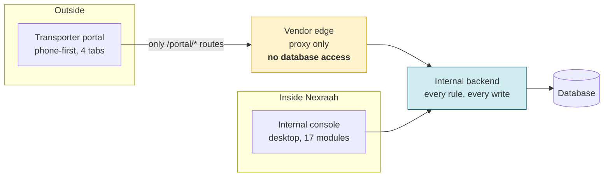

The vendor edge holds **no database credentials at all**. Even a bug in it has nothing to leak, because it never holds the data. See [section 14](#14-the-wall-between-the-two-apps), and [section 7](#7-the-transporters-side-of-the-same-order) for what a transporter actually sees.

---

## 2. The whole business in one picture

Four stages. Two of them (supply and demand) run continuously in the background; the third is what happens to one shipment; the fourth is getting paid for it.

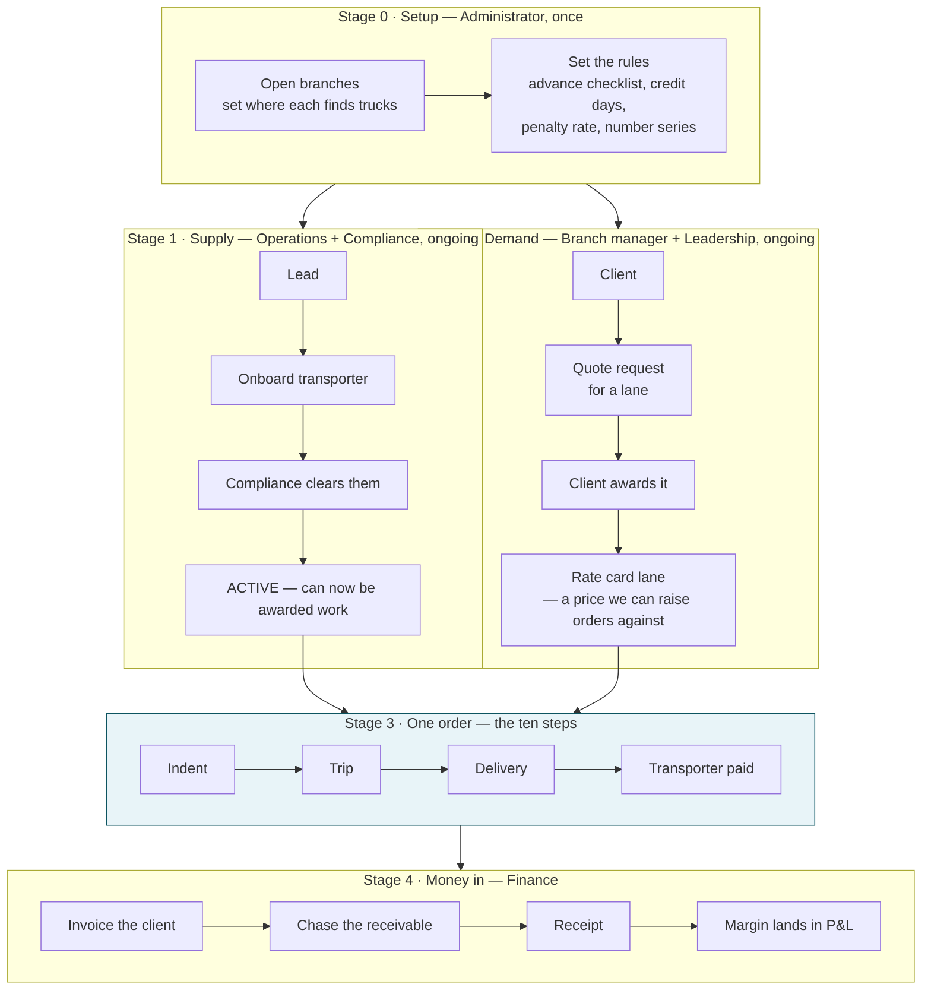

**The dependency that trips people up:** you cannot raise an order until *both* background stages have produced something. Stage 1 must have at least one cleared transporter who can serve the route, and stage 2 must have given you a price to sell at. If either is missing, the order will be raised and then sit there — which is exactly what the "placement failed" state on the Today screen is telling you.

---

## 3. Stage 0 — Setup, done once

Administrator only. Everything downstream reads these.

| Do this | Where | And then it feeds… |
|---|---|---|
| Open your branches, set catchment radius | Control panel → Branches | Every branch dropdown in the app — transporter onboarding, orders, quote requests. Open a branch here and it is available everywhere immediately |
| Record **where each branch finds trucks** | Control panel → Branches | Explained below |
| Set the advance document checklist | Control panel | The advance payment gate ([step 5](#step-5--advance-paid)) |
| Set default advance %, client credit days, delivery-note penalty rate and deadline | Control panel | Order defaults, the delivery-note clock, the balance calculation |
| Set the numbering series | Control panel | Lorry receipt, invoice and order codes — gap-free, so you can prove none is missing |
| Set company letterhead | Control panel | Printed lorry receipts and invoices |
| Check the roles matrix | Control panel → Roles | Who can see and do what |

### Where trucks come from — "supply source"

A branch does not source trucks one way. Some routes are served by the local **transport union**, some off the **open market**, some by **direct owners** we contract with, and most branches are a mix of the first two.

That answer changes how a route is priced, who to call when nobody can be found, and whether a shortage is a recruitment problem or a pricing problem.

It is recorded in three places, because it is decided at three different moments:

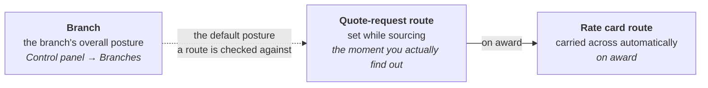

Four values — Union, Market, Both, Direct owners — plus free-text remarks. **Neither is ever required.** "Not recorded" is a real, visible state, because someone has to be able to see that nobody has answered the question yet. And four values cannot express *"union only during cane season"*, so forcing a wrong choice would lose more than an empty column does.

---

## 4. Stage 1 — Supply: getting transporters onto the panel

**The rule that shapes this whole stage: the desk that recruits a transporter is not the desk that vouches for them.** Operations can open a transporter's record and fill in every detail. Only Compliance can mark the documents verified and switch them on.

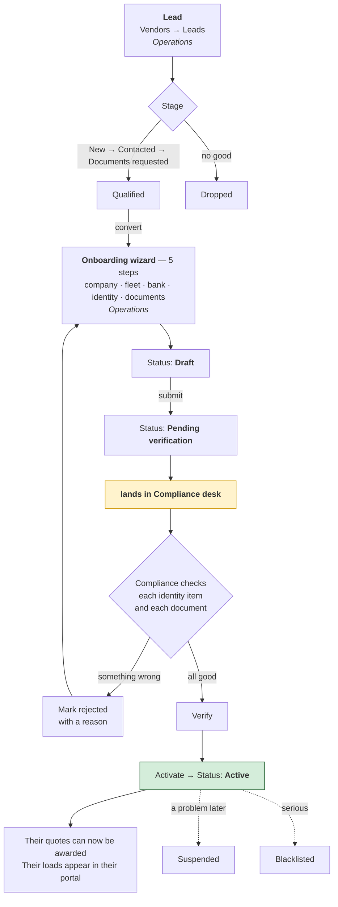

**How Compliance actually clears a file.** Both tables on the transporter's record — identity items and legal documents — carry the same two actions, and only Compliance sees them: **Verify**, offered only on an item that has been uploaded and is waiting; and **Reject**, which requires a written reason. Rows that cannot be acted on say why instead of showing a dead button — *"Not uploaded yet"*, *"Needs a fresh upload"*, or *"Compliance verifies"* if that is not your desk.

Activation refuses outright unless **every** identity item and **every** required document is verified — not merely present. A refusal names each unmet item, so the operator is never guessing at what is still outstanding. The same list also runs *before* you click, as a live check on the file — and both are worded identically, so what you see beforehand is exactly what a refusal would tell you. The pre-check is worth trusting.

> **One thing activation does not yet do: create their login.** The record goes Active and their quotes become awardable immediately, but the step that provisions the portal account is waiting on a product decision, so it does not run. The screen tells you which happened — *"portal login not yet set up"* rather than a blanket claim that the account exists. Until that decision lands, somebody creates the account by hand. See [section 12](#12-where-handoffs-actually-land).

**After activation, where things go:**

| Thing | Goes to | Picked up by |
|---|---|---|
| The transporter record | Vendors directory — fleet size, trip count, our margin on them, their advance % | Everyone |
| Their vehicles | Their own Fleet tab in the transporter portal | Them |
| Matching open orders | Their Loads tab | Them |
| A complaint about them | Vendors → Issues, and the Today screen if it's high severity | Operations / Branch manager |
| Routes where we have too few transporters | Vendors → Market gap | Operations — this is a recruitment target, feeding back to Leads |

**Vehicle statuses in their portal:** Available · On trip · Documents due · Maintenance. "Documents due" is set by the system only, when a compliance document has expired. A transporter cannot clear it by picking a different status — they have to re-upload the document under Profile.

---

## 5. Stage 2 — Demand: winning a lane

A "lane" is a recurring route for one client — say Nagpur → Hyderabad, 32-foot trailer. Winning a lane is what makes it possible to raise individual orders against it at a known price.

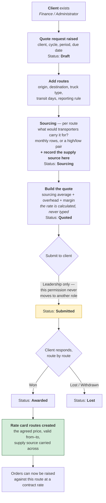

**Two things worth knowing:**

- **The quoted rate is derived, never keyed.** Sourcing average + overhead + margin. If the number looks wrong, one of the three inputs is wrong — you cannot type over the answer.
- **Award writes the rate card and shows you exactly what it wrote.** The preview before you confirm matches the rows created, one for one.

A route can also be priced **spot** instead — a one-off, with a confirmation document attached to the order rather than a standing rate card entry.

---

## 6. Stage 3 — The order: the ten steps

This is the spine of the whole application. Every order moves through these ten, in this order, and the Orders screen shows each one exactly where it stands.

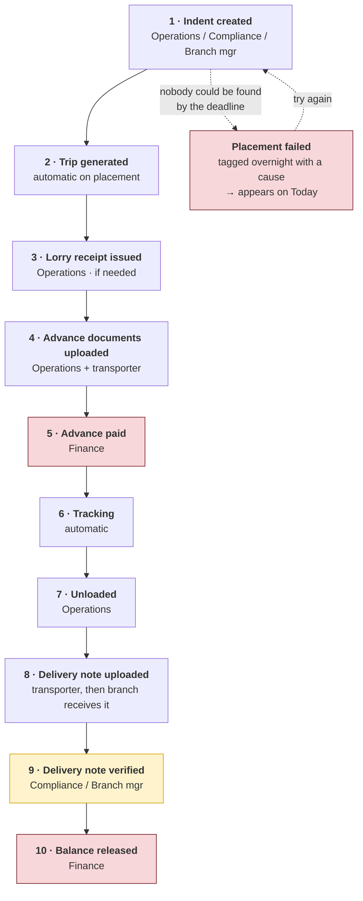

The two red steps are the **money gates**. Neither opens on judgement — each has a checklist, and the screen tells you by name what is missing.

Glossary for this section, once: an **indent** is a request for one truck on one route on one date. A **lorry receipt** is the consignment note that travels with the goods. A **delivery note** (POD, "proof of delivery") is the signed paper the consignee returns proving the goods arrived.

### Step 1 — Indent created

**Who:** Operations, Compliance or a Branch manager. **Where:** Indents → Raise an indent.

You capture three things:

| | What |
|---|---|
| **The requirement** | Client, branch, from and to city, material, weight, truck type, pickup date, transit days, reporting rule |
| **The pricing** | Contract rate (pulled from the rate card the quote request won) or spot rate; and the sell rate — what we charge the client |
| **The placement terms** | The price band a transporter's quote must fall inside, and the advance % |

**The band locks on publication.** Not when quotes arrive — on publication. Widening it later to force a match is precisely the shortcut this exists to block. A route that keeps missing its band is a supply problem, not a pricing-tweak problem, and it belongs in Market gap.

**Where it goes next:** two places at once.

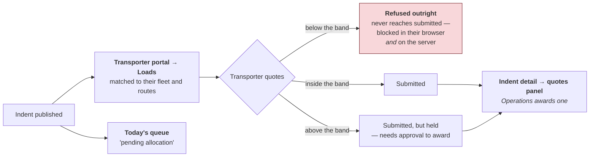

**Awarding.** Operations picks a quote on the indent. Three things happen:

1. A quote from a transporter who is not **Active** cannot be awarded at all.
2. An **above-band** award does not go through — it raises an approval and parks ([section 9](#9-the-approval-interrupt)). On approval it replays by itself.
3. Every other transporter's quote becomes **lost**, with a fixed reason — awarded elsewhere, order cancelled, or expired. Never a price. Never a competitor's name.

The award writes the **buy rate** onto the order. That is the moment the margin on this load becomes real.

**Placement.** Operations then keys the vehicle number, driver name, driver licence and the reported-at time, and flags late reporting as a transit delay in its own right.

> **A quirk worth knowing.** On the Orders board, awarding and placement both still read as **"Indent created"**. Only the trip appearing moves the badge on. This is deliberate — the ten steps are the client-visible milestones, and who the truck is comes up as plain facts in the side panel, not as a step. If you want award and placement detail, open the indent itself.

**If nobody is placed by the deadline,** an overnight sweep at 01:00 tags the indent with a cause. Its status becomes **Placement failed**, and it appears on the Today screen under "Placement failures" so it does not sit looking merely unstarted.

### Step 2 — Trip generated

Automatic. Once a vehicle is placed, the indent becomes a **trip** — the record that carries the lorry receipt, the documents, the charges and both payments.

**Where it goes:** Trips (internal), and the transporter's own Trips tab. Their trip card leads with what they are owed, not with logistics.

### Step 3 — Lorry receipt issued *(if needed)*

**Who:** Operations. **Where:** Trip → Lorry receipt.

The consignment note: consignor, consignee, goods, the client's invoice reference, the e-way bill, vehicle, driver, transit days, and the charge heads. It moves Draft → Booked → Released → In transit → Delivered.

Printable with a barcode. **Sharing it with the transporter is optional and never a required step** — they can view it in their own portal anyway.

### Step 4 — Advance documents uploaded

**Who:** Operations collects, Compliance verifies. **Where:** Trip → Documents.

Eleven documents in five groups. **Eight of them gate the advance:**

| Group | Documents |
|---|---|
| Client | Client invoice or purchase order · E-way bill |
| Vehicle | Registration certificate · Goods insurance · Fitness certificate · National permit · Pollution certificate |
| Driver | Driving licence |
| *(not gating)* | Lorry receipt · Delivery note |

Each document moves **Missing → Uploaded → Verified**, or **Rejected** with a reason.

The exact eight are configurable in the control panel. **Removing one releases money that was previously held**, so that change is audited.

A **cross-check** compares the values keyed off different documents — the vehicle number on the registration certificate against the one on the e-way bill, and so on. A mismatch must be resolved, or explicitly overridden with an approval.

This step shows as done when all eight are *present*. Present is not verified — that is the next gate's job.

### Step 5 — Advance paid

**Who:** Finance, and only Finance. **Where:** Payments → Advance.

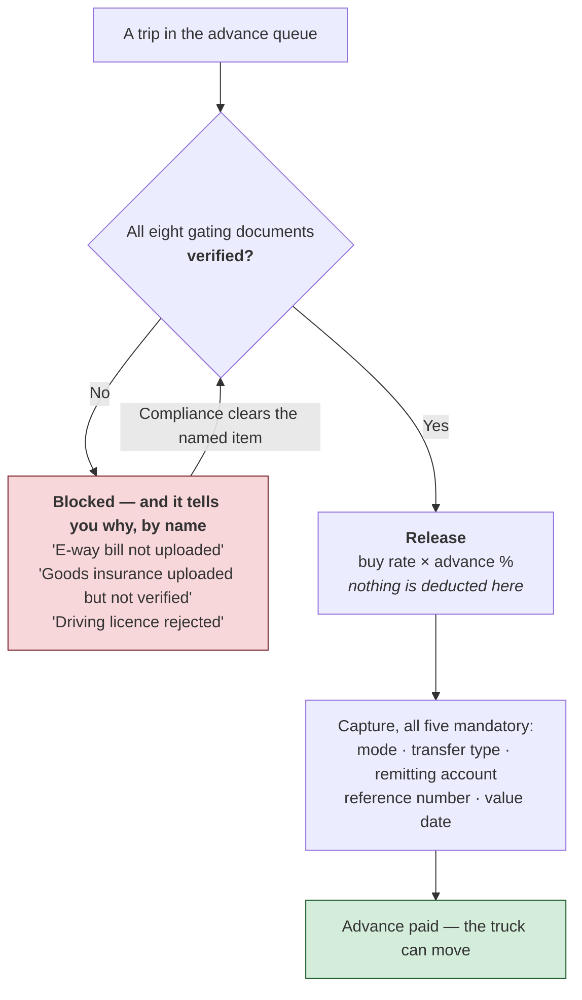

**Compliance clears the documents; Finance releases the money.** Both roles see this screen. Only Finance holds the release permission, and it never moves to a second role — so Compliance can work the checklist without ever being able to pay against it.

Transfer can go to the transporter's account, the driver's account, a fuel card, or cash at the branch.

**Where it goes:** the transporter's trip card immediately shows the advance as paid.

### Step 6 — Tracking

The trip moves to **in transit**. Two views: the live vehicle board, and the trip's own tracking panel.

Five alerts, re-derived on every position report: **overspeed · long halt · no signal · e-way expiring · e-way expired.**

> The receiving endpoint for position reports is live and secured. No tracking provider is connected to it yet — the pipe is built, the water is not turned on.

### Step 7 — Unloaded

Trip moves to **delivered**, and the delivery date is recorded.

**This date starts the delivery-note clock.** Everything in steps 8 and 9 is measured from here.

Also at this point: **charges** are captured on the trip — loading, unloading, labour, halt, detention, other. Each carries **two figures, never one**: what it cost us, and what we billed the client. A trip delivered with no charges captured gets flagged by a weekly sweep.

### Step 8 — Delivery note uploaded

Two separate events that people constantly conflate:

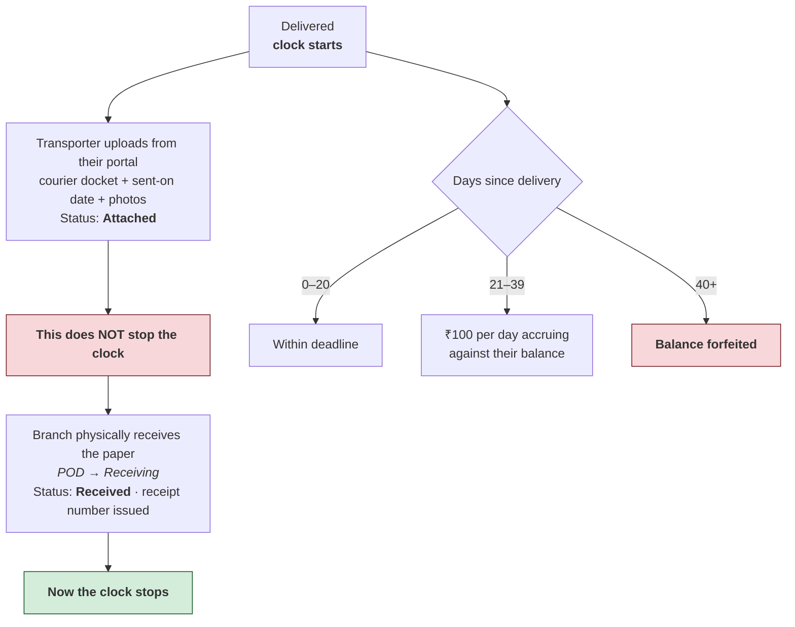

The **POD → Pending** screen lists every open one with days remaining, filterable by within deadline, breached, or forfeited. Overdue ones also surface on the Today screen.

The 20-day deadline, the ₹100 per day and the 40-day forfeit are all configurable in the control panel.

### Step 9 — Delivery note verified

**Who:** Compliance, or the Branch manager. **Where:** POD → Verify.

Two distinct actions: **verify** (it was checked) then **approve** (it is accepted). **Rejecting sends it back and does not stop the clock** — the penalty keeps accruing while it is being fixed, which is the entire point.

A penalty can be **waived** — but that is a proposal, not a decision. It raises an approval that goes to Leadership. Only when they approve does the penalty actually zero.

Statuses in this chain, worded the same on every screen:

| Status | Means |
|---|---|
| Waiting on the transporter | Nothing uploaded yet |
| Attached by the transporter | Uploaded — clock still running |
| Received, not yet checked | Branch has the paper — clock stopped |
| Checked, awaiting approval | Verified |
| Approved | Done — the balance gate opens |
| Penalty waived | Leadership approved a waiver |
| Not received in time — balance forfeited | Past 40 days |

### Step 10 — Balance released

**Who:** Finance. **Where:** Payments → Balance.

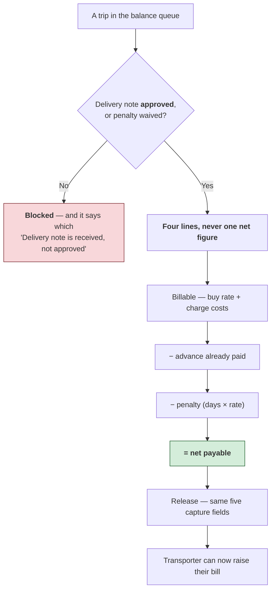

**The transporter's own bill.** Once the delivery note is approved they can submit their invoice against the trip. If their figure is **above** our computed balance it is **flagged for review, not rejected** — their number might be the correct one. Accepting at their figure requires a written reason, recorded against the bill.

That is the tenth step. The transporter side of this order is finished.

---

## 7. The transporter's side of the same order

Everything in section 6 has a mirror image. Here is that same shipment as the trucking company experiences it — four tabs, a profile screen behind the account link, and an optional phone app wrapped around all of it.

**They cannot sign themselves up.** There is no registration screen anywhere, and no endpoint behind one. A transporter's login exists because **Compliance activated them** in [section 4](#4-stage-1--supply-getting-transporters-onto-the-panel) — that activation is what creates the account. So when someone cannot log in, the answer is usually upstream: they are still draft, still pending verification, or suspended. (One caveat — activation does not yet finish creating the account itself; see [section 12](#12-where-handoffs-actually-land).)

### The four tabs

**1 · Loads** — open orders they may bid on, filtered to their truck types and branch.

- Quoting **below the band is refused and nothing is stored** — not saved as a draft, not queued. The error names the minimum.
- **Above the band submits but is held** for approval. It does not become a live quote until Leadership signs it.
- **A vehicle with documents due cannot be offered** at all.
- One quote per load; a second attempt is refused.

> **When someone else wins, the load simply disappears from the list.** It is never shown as lost, outbid, or filled. A count of competing quotes, a price gap, even a sympathetic *"you were beaten on price"* — all of it is withheld deliberately. The absence **is** the design.

**2 · Quotes** — every quote they have placed. A lost one carries a fixed, plain sentence and nothing else:

| Why it was lost | What they actually read |
|---|---|
| Awarded elsewhere | "This lane was awarded elsewhere. The load went to someone else." |
| Order cancelled | "The load was cancelled before it was given to anyone." |
| Expired | "The load closed before it was given to anyone." |

Never a price. Never a competitor. Never how close they were. They can **withdraw** a quote, but only while it is still submitted.

**3 · Trips** — won loads in motion. Each card **leads with money, not logistics**: advance status and, if blocked, exactly which documents are missing; the balance due; and the delivery-note clock.

> The consignment note is served as a **signed link that expires in fifteen minutes**, pointing at a document the server renders. It is not drawn from the data the portal holds — the paper legally names consignor and consignee, and the portal's own copy of that trip must not carry either.

**4 · Fleet** — their vehicles: registration, capacity, current city, availability. `Documents due` is derived from document state and **cannot be set by them** — a request naming it is rejected outright, not quietly ignored.

**Profile** sits behind the account link rather than being a fifth tab, and holds company details, identity documents with per-document status and rejection reasons, and a business summary. It is **masked**: the last four digits of the PAN and bank account, never the whole number.

### Where their two writes land

| They do this | It becomes | Picked up by |
|---|---|---|
| **Upload the delivery note** — file, courier docket number and sent-on date, all three required | Status `attached` | Nobody yet. **The clock keeps running**, and the confirmation they see is worded so it does not suggest otherwise |
| **Raise a bill** — only once the delivery note is approved | A bill, with the four-line balance shown beside it | The desk. Above our figure it is **flagged, not rejected** — refusing it silently starts a phone call the branch has no record of |

Every write carries an idempotency key, so a retry on a bad signal cannot double-submit a quote or a bill.

### The phone app is a shell around the portal

`vendor-mobile` is an Expo app that does **not** reimplement any of the above. It loads the portal in a web view and adds the one thing a browser cannot do well: **native document capture**.

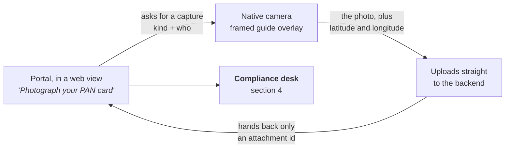

The photo goes **straight from the phone to the backend**. It is never relayed back through the web view, which would mean encoding the whole image as text. Only the resulting attachment id crosses back, and the web page carries on as though the browser had produced it.

Three kinds go through this path: **PAN card**, **Aadhaar card**, and the **geo-stamped selfie at the yard** — which is why location travels with the upload. Everything else the transporter does happens in the web view, unchanged.

> **Status today.** The transporter's read screens are served by the real backend. The writes — quote, withdraw, delivery-note upload, bill, fleet changes, document upload — are the next wave, so both portals still run on fixture data by default. See [section 15](#15-running-it).

---

## 8. Stage 4 — Billing the client

This runs in parallel with the back half of the order, and it is entirely Finance's.

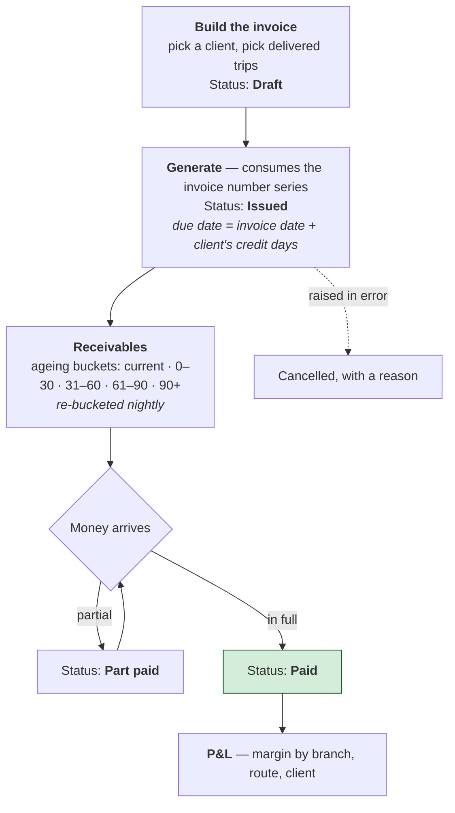

Three details that surprise people:

- **There is no tax field anywhere on an invoice.** Reverse charge is permanent for this entity — the client accounts for the tax, not us. A configurable rate would imply otherwise, so there isn't one.
- **Rupee rounding happens on the invoice and nowhere else.** Everything upstream is held in paise, exactly.
- **Recording a receipt requires a reference** — the bank reference or cheque number. Not optional.

Invoices and the P&L are both printable on company letterhead.

---

## 9. The approval interrupt

Six things cannot simply be done. Each one **pauses, parks in the approvals inbox, and replays itself automatically on approval** — you never re-key the original action.

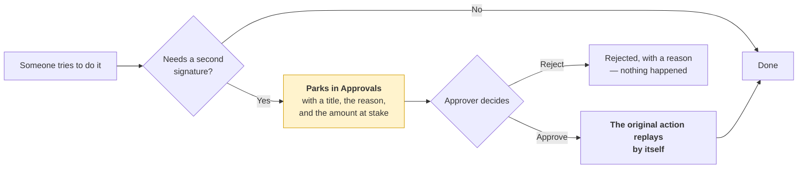

| What needs approval | Raised when | Decided by |
|---|---|---|
| **Above-band price** | Awarding a quote above the order's band | Leadership |
| **Advance override** | One load departing from the standing advance policy | Senior to Operations |
| **Advance policy change** | Changing a transporter's standing advance % | Senior to Operations |
| **Penalty waiver** | Compliance proposes waiving a delivery-note penalty | Leadership |
| **Document override** | Pushing past a cross-check mismatch | Senior to Operations |
| **Branch override** | Acting outside your own branch | Leadership |

Administrators deliberately hold **none** of these. For them the approvals inbox is an audit view, never a decision — which is what the screen's own wording says.

---

## 10. What runs on its own

No human behind any of these. Every one is also runnable by hand from the control panel, so you never have to wait for the clock to test something.

| Job | When | What it does — and where the result lands |
|---|---|---|
| **Delivery-note ageing** | 00:30 daily | Recomputes every open note's age and penalty; forfeits at 40 days → POD Pending, Today |
| **Placement failure** | 01:00 daily | Tags orders nobody could place with a cause → Today's "Placement failures" |
| **Invoice ageing** | 02:00 daily | Re-buckets every open invoice → Receivables |
| **Bank reconciliation** | 03:00 daily | Matches released payments against the bank statement |
| **E-way expiry** | Hourly | Raises expiring / expired alerts → vehicle board, trip panel |
| **Vehicle alerts** | Every 15 min | Re-derives the five alerts from position reports |
| **Notifications** | Every minute | Sends whatever is queued |
| **Charge-capture exception** | Sundays | Flags trips delivered with no charges captured |
| **Retention sweeps** | Sundays | Ages out old attachments and identity images |
| **Forfeiture report** | 1st of the month | Last month's forfeited balances → Leadership |

---

## 11. Every status, in one place

**Order** — the ten steps, plus the exception branch:
`Placement failed` · Indent created · Trip generated · Lorry receipt issued · Advance documents uploaded · Advance paid · Tracking · Unloaded · Delivery note uploaded · Delivery note verified · Balance released

**Indent:** Open → Vendor assigned → Vehicle placed → Trip created

**Trip:** Open → In transit → Delivered → Closed

**Delivery note:** Waiting on the transporter → Attached → Received → Verified → Approved *(or Penalty waived, or Forfeited)*

**Any document:** Missing → Uploaded → Verified *(or Rejected)*

**Transporter:** Draft → Pending verification → Active *(or Suspended, Blacklisted)*

**Lead:** New → Contacted → Documents requested → Qualified → Converted *(or Dropped)*

**Quote request:** Draft → Sourcing → Quoted → Submitted → Awarded *(or Lost)* → Closed

**A transporter's quote:** Submitted → Accepted *(or Rejected, Withdrawn)*

**Invoice:** Draft → Issued → Part paid → Paid *(or Cancelled)*

**Lorry receipt:** Draft → Booked → Released → In transit → Delivered

**Vehicle:** Available · On trip · Documents due · Maintenance

**Colour, one meaning everywhere:** green = settled, nothing to do · blue = moving, wait · amber = needs *your* action · red = blocked or rejected, fix it · grey = inactive.

---

## 12. Where handoffs actually land

Every handoff in this document ends with a record arriving somewhere. Two mechanisms carry it: **a queue you look at**, and **a message you are sent**. They are not the same, and only one of them is fully wired today.

### Today's queue — the screen the whole console orbits

Four working queues and no vanity metrics. It answers *what needs a decision today*, and nothing else.

| Queue | What is in it | Where it came from |
|---|---|---|
| **Pending allocation** | Orders waiting on a transporter — with the freight at stake, how many have no quotes at all, how many have quotes in, the earliest pickup and total tonnage | [Step 1](#step-1--indent-created). An order sits here from publication until a vehicle is placed |
| **Placement failures** | Orders nobody could place, each with a named cause | The overnight sweep at 01:00 |
| **Delivery notes overdue** | Trips past the 20-day deadline, with days elapsed and the balance being held | The 00:30 ageing job |
| **Vendor issues** | Open complaints against a transporter, by severity | Raised by hand from a transporter's record |

**The five causes of a placement failure.** This is the part that turns *"it didn't work"* into something you can act on:

| Cause | What actually happened | What to do about it |
|---|---|---|
| **No quote at all** | Nobody bid | A recruitment problem — check Market gap for this route |
| **Only above-band quotes** | People bid, all above the ceiling | A pricing problem, or a genuine market move. The band was set too low |
| **In band, none awarded** | Usable quotes arrived and nobody acted on them | An Operations problem, not a market one |
| **Truck never reported** | Awarded and placed, then the vehicle never turned up | A transporter reliability problem — worth logging an issue against their record |
| **Client cancelled** | The load went away | Nothing to fix |

> The second and third causes are different diagnoses that look identical from a distance — *"the order failed"*. One says the market would not carry it at your price. The other says somebody had a workable quote in hand and let it expire. Never treat them as the same row.

### Who gets told

A queue only works if somebody looks at it. For everything outside the console — and for approvals nobody would otherwise notice — there is a message catalogue:

| Event | Fires when | How |
|---|---|---|
| Transporter activated | Compliance clears their file | SMS |
| Load published | A new order matches their operating states and fleet | SMS |
| Quote awarded | The award completes | SMS + push |
| Consignment note released | It is issued — **only if they asked for electronic sharing**; sharing is never a required step | WhatsApp, with the document |
| Delivery note due | Day 15 | SMS |
| Delivery note breached | Day 21, then weekly | SMS |
| Delivery note rejected | Verification fails | SMS + push |
| Forfeit warning | Day 35 | SMS |
| Payment released | Advance or balance paid | SMS, carrying the reference number |
| Bill queried | Finance queries their bill | SMS |
| Approval raised · decided | The approvals engine | In-app, to both the approver and whoever raised it |

Every message is transactional — **no promotional messages, ever**. Dispatch runs every minute against a table that records the template, the payload, the status and the provider's reference. A failed send retries; it never silently drops.

> **Status today.** The table, the dispatcher and the catalogue all exist. Only **two** events actually enqueue anything so far — transporter activation, and the monthly forfeiture report. The rest are designed and unwired. So **do not assume anyone was told**: the queues above are the reliable mechanism right now.

### One gap to know about before going live

**Activating a transporter does not yet create their login.** The activation itself is real and fully checked. But the step that provisions their portal account needs an administrative credential this deployment deliberately does not hold — so it records itself as *pending* and queues the first-login message rather than pretending it worked.

Until that is resolved, an activated transporter cannot sign in until somebody creates their account by hand. It is flagged rather than faked on purpose: the alternative was a silent no-op that looks exactly like success.

The console says so too. On activating, the screen reads **"portal login not yet set up"** rather than claiming the account exists, and it reads that from what the server actually did rather than from a fixed line of copy — so the day provisioning is wired, the same screen starts saying "portal login created" with nothing further to change.

Worth being precise about what the open decision is. The written contract for activation says it creates the login and sends the first-login message; the implementation does neither. So the choice is not really about wording — it is whether the implementation moves up to the contract (a narrowly scoped administrative credential, carved out and reviewed) or the contract moves down to the implementation (accounts provisioned by hand, and the spec amended to say so).

---

## 13. Your day, by role

Six roles. A module you cannot act on is **absent from the sidebar entirely**, never greyed out — if you do not see Payments as Operations, that is correct, not a bug.

| Role | Lands on | Opens with | Hands off to |
|---|---|---|---|
| **Operations** | Today's queue | Orders with no quotes, placements that failed overnight | Compliance (documents), Finance (payment) |
| **Compliance** | Compliance desk | Transporters awaiting clearance, documents awaiting verification, delivery notes awaiting approval | Operations (rejections go back), Finance (cleared documents open the advance) |
| **Finance** | Payments → Balance | Balances ready to release, then advances, then invoicing and collections | Nobody — Finance is the end of both money chains |
| **Branch manager** | Today's queue | Their own branch only: placement performance, margin, delivery notes to receive and approve | Same as Operations, scoped to their branch |
| **Leadership** | Monthly overview | Approvals waiting on them, quote requests to submit, the business review | Whoever raised the approval — it replays on its own |
| **Administrator** | Control panel | Configuration, branches, roles, imports. **Not** day-to-day decisions | Everyone, by configuration |

Two divisions of labour that look like duplication until you see the seam:

- **Operations onboards a transporter; Compliance clears them.**
- **Compliance checks the advance documents; Finance releases the money.**

Both are the same principle: the desk that wants the thing to happen is not the desk that says it may.

---

## 14. The wall between the two apps

A transporter must never learn who the client is, what we charged them, or what any other transporter quoted.

That is guaranteed four ways, so a leak requires deliberate work rather than a moment's forgetfulness:

| Layer | What it buys |
|---|---|
| **Two separate apps** | No shared layout or component that could render a client name on a transporter's screen. No "if transporter" branch to get wrong |
| **Two database roles** | Transporter-facing queries run as an account with column-level grants only. A query that reaches for the client or the sell rate **fails at the database** |
| **The edge holds no credentials** | The public-facing service has no database access at all. It has nothing to leak |
| **Separate deployables** | The external edge can be rolled back or firewalled on its own |

If you are extending the transporter portal, treat any new field touching client identity, our sell rate, or another transporter's data as a hard stop — not a code-review nitpick.

---

## 15. Running it

```bash
pnpm install

pnpm dev:internal   # internal console + backend
pnpm dev:vendor     # transporter portal + edge
pnpm dev            # everything
```

| | URL |
|---|---|
| Internal console | http://localhost:3002 |
| Transporter portal | http://localhost:3001 |
| Backend | http://localhost:4002/api/v1 |
| Transporter edge | http://localhost:4001/api/v1 |

**Signing in.** There is no real login yet. The bottom of the internal sidebar has a **role switcher** — a prototype control that changes what you can see and do. It disappears when real sign-in lands.

**Both apps run on fixture data by default**, because the transporter *write* routes — submitting a quote, uploading a delivery note, raising a bill — are not built yet. The fixtures return the exact shapes the real backend returns, so no screen behaves differently.

**On a phone:** the transporter portal is phone-first by design. The internal console collapses its sidebar into a drawer below 900px and turns every table into stacked cards rather than forcing sideways scrolling.

For the module-by-module tour, testing, design system and integration status, see [`END_TO_END_GUIDE.md`](END_TO_END_GUIDE.md). For wire formats and business-rule references, see [`docs/`](docs/).
